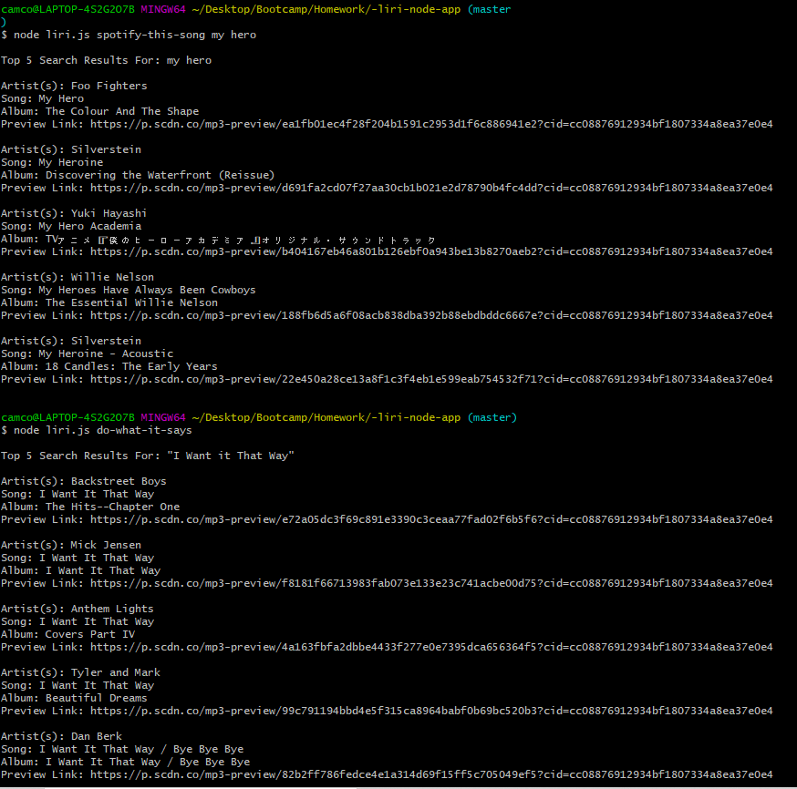

# **LIRI App**
This is *LIRI*, a Language Interpretation and Recognition Interface. *LIRI* is a command line node application that takes in parameters and gives back helpful data.

The app supports:
* spotify-this-song
    * Requires a song name
* concert-this
    * Requires a band name
* movie-this
    * Requires a movie name
* do-what-it-says

**Functionality**

*LIRI* uses the inputed data, and access specific api's for each command. The spotify-this-song command utilizes the node spotify api, while the concert-this and movie-this commands utilize axios to access their rescpective api's. While the do-whatit-says command reads the random.txt file, it currently shows spotify-this-song,"I Want it That Way", and then runs the command. 

This is the output of both movie-this and concert-this: 

This is the output of both spotify-this-song and do-what-it-says: 

**NPM's required**
* Spotify api
* dotenv
* axios
* fs
* moment